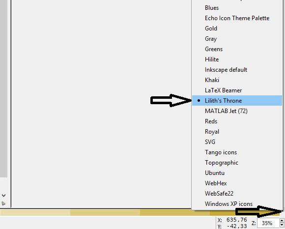

# Palette

Inkscape palette with predefined primary, secondary and tetriary colors for clothes.

### Installation

Put [liliths-throne.gpl](liliths-throne.gpl) into 

```
"inkscape instal directory"/share/palettes
```

### Usage

In Inkscape select proper palette:

